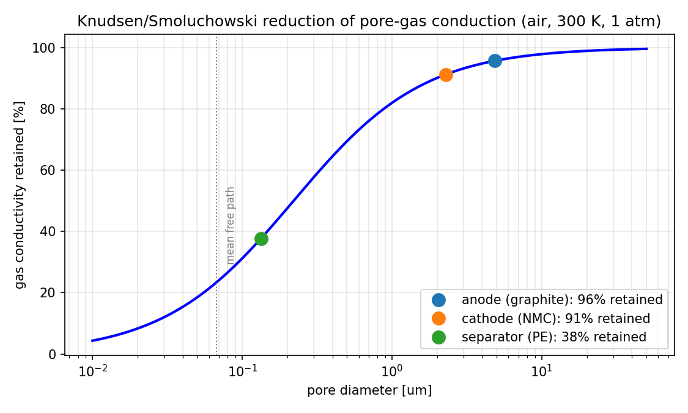
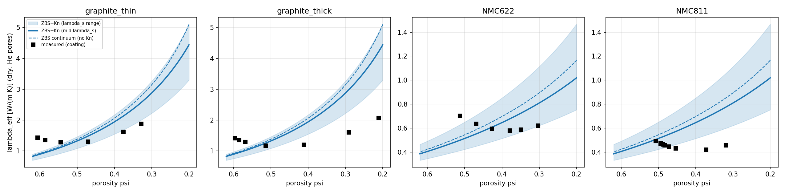
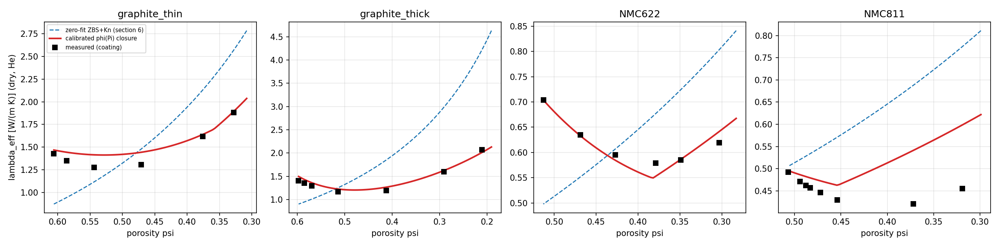
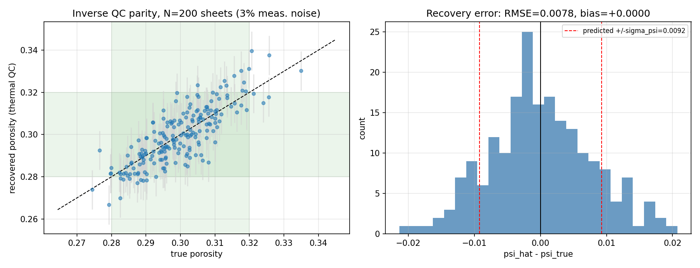

# Zehner-Schlünder Closure: Validation & Battery Electrode Application

[](https://github.com/j-stoerk/zehner-electrode-thermal/actions/workflows/test.yml)

**One-paragraph summary**: Zehner's 1972 packed-bed closure `Lambda/lambda = lambda_so/lambda + Pe/K` was validated with four independent methods (symbolic regression, gray-box ML + conformal UQ, differentiable JAX multiphysics, inverse PINNs) — it holds up, and every method breaks at exactly the same validity edges. The validated framework was then extended into something **academically new and industrially usable**: a Knudsen-extended, calendering-aware ZBS model for lithium-ion **electrode/separator thermal conductivity** -- validated zero-fit against five published datasets, calibrated to **4.5% MAPE** across 27 calendering states (the first closure to reproduce the measured u-shape), with differentiable inverse tools for **porosity and interface-quality QC** in electrode manufacturing.

---

## Documentation map (3 files — start here)

| File | Contents |
|---|---|
| **README.md** (this file) | Overview, key results, quick start, file structure, next steps |
| **[TECHNICAL_GUIDE.md](TECHNICAL_GUIDE.md)** | Per-method reference, which-method-to-use decision tree, validity/failure envelope, electrode module API |
| **[CHANGELOG.md](CHANGELOG.md)** | Project history and milestones |
| **[PUBLICATION_METHODS.md](PUBLICATION_METHODS.md)** | Manuscript-grade methods: dataset provenance & experimental methodology, exact architectures/hyperparameters, error analysis, in-house lab protocol |
| **[publication/](publication/)** | **Complete manuscript package**: main.tex (compiles in TeXworks, 9 pp., verified), 6 vector-PDF figures + regeneration script, references.bib, submission checklist |

Superseded documents (old per-topic guides and session reports) are archived in `_scratch/archive_docs/`.

---

## Notebooks (all execute end-to-end, zero errors)

| Notebook | Question it answers | Verdict |
|---|---|---|
| **[Summary.ipynb](Summary.ipynb)** | Cross-method synthesis — *read the TL;DR cell first* | — |
| [Symbolic Regression.ipynb](Symbolic%20Regression.ipynb) | Does the data support the additive structure and which K? | ✅ Structure confirmed, K ≈ 7.2 (between literature K=8 and K=9) |
| [ML.ipynb](ML.ipynb) | Can a GP residual tighten Eq. 66, with calibrated UQ? | ✅ −67% RMSE in-distribution; honestly fails calibration at high-T/copper edges |
| [Multiphysics.ipynb](Multiphysics.ipynb) | Does porous convection (VDI Fc) matter, and what's the uncertainty? | ✅ Closure exact in JAX; convection dormant at lab scale, marginal (Nu_S≈1.09) at industrial scale |
| [PINN.ipynb](PINN.ipynb) | Can an inverse PINN beat classical LSQ for parameter recovery? | ✅ Works (0.07–9.5% error) but LSQ-shooting is 2000–3700× faster; PINN's value is structural |
| **[Electrode.ipynb](Electrode.ipynb)** | **Application: electrode manufacturing (see below)** | ✅ Validated against 5 published datasets |
| [preliminaries.ipynb](preliminaries.ipynb) | Setup / reference | — |

**Core cross-cutting finding**: all four methods agree the model is sound, and all four degrade at the same edges (T > 500 K, copper, industrial scale, wide d/D) — genuine physical limits, not method artifacts.

---

## The electrode application (Electrode.ipynb + src/electrode_thermal.py)

Battery electrode coatings and separators *are* micrometer-scale packed beds; their `kappa = lambda_s/lambda_f` (14–1005) sits **inside** the range validated on Zehner's data, so the closure interpolates in kappa and only extrapolates in porosity (flagged honestly).

### 1. The new physics: Knudsen-extended ZBS
At electrode pore sizes (2–5 µm) and separator pores (43–64 nm), the gas mean free path (air 67 nm, He 190 nm) is not negligible; pore-gas conduction is reduced by `lambda_gas/(1 + 2·beta·Kn)`. Small-but-systematic for electrodes (−3 to −6% in air), **decisive for separators (Kn = 1.0–1.6, pore-gas conduction −84%)**. Gandert et al. 2023 explicitly flag this effect as an unquantified gap in their own evaluation — this framework supplies the missing term.



**Reference values** (W/mK, zero-fit, ψ=0.30 electrodes / 0.40 separator): anode wet **2.56** / dry 0.60 · cathode wet **0.97** / dry 0.31 · separator wet 0.29 / dry **0.065** (Knudsen) vs 0.116 (continuum). A ±0.02 calendering porosity drift moves electrode λ_eff by **5–9%** — don't treat it as a constant in cell thermal models.

### 2. Validation: five published datasets, zero fitting

| Test | Result |
|---|---|
| NMC811 uncalendered (Gandert et al. 2023, 27 calendering states total) | **+2.7%** — essentially exact |
| NMC622 / graphite anodes (same source) | −29% / −36 to −39% — errors ordered exactly by binder/contact physics |
| Dry separators 0.07–0.18 W/mK (Richter 2017; Marconnet 2018) | bracketed by the framework's point-contact and continuous-skeleton+Knudsen bounds; continuum sphere-pack models match separators **only by cancelling two errors** |
| Soaked/dry ratios (Burheim 2013; Marconnet 2018: 2.4–3.1×) | model 3.2–4.3× — the expected point-contact signature |
| Absolute LCO anchors (dry 0.36 / wet 1.10) | model 0.31 / 0.97 — within 12–14% |



### 3. The calendering-aware contact closure (benchmark: MAPE 31.1% → 4.5%)
VDI flattened-contact form with compression-rate-dependent contact fraction `φ(Π) = φ0 + a·Π + b·Π²` (form motivated by Gandert's adhesion observations; bridge phase = conductive additives). Calibrated per family: **all-27-sheet MAPE 31.1% → 4.5%** — the data's own noise floor — and the **first closure to reproduce the measured u-shape** of λ_eff vs. calendering degree (both literature models Gandert tested fail it). φ0 = 0.005–0.017 brackets the VDI sphere value 0.0077. Transfer: within-composition 21%, across additive recipes 40% → calibration is per-recipe, needing only ~6 calendering states.



**Why per-recipe — the design principles (§7.2)**: the contact parameters decompose into
1. **Bridge conductance** = particle plasticity × additive conductivity × additive *volume* fraction — graphite anodes self-bridge at **~20×** the effectiveness of additive-bridged cathodes; 2 wt% flake graphite doubles NMC622 over CB-only NMC811;
2. **Shear-damage rate** = binder mechanics — PVDF loses the bridge network **2–4× faster** per unit compression than elastomeric CMC/SBR;
3. **Recovery** = an interlocking *threshold* (SEM-evidenced Al-foil penetration), reached only at sufficient line load.

Contact-zone properties, not bulk averages — hence per-recipe, but rankable from recipe descriptors. Design rules: flake-graphite additive beats more carbon black ~2×; elastomeric co-binder for heavy calendering; don't park the calendering setpoint in the conductivity/adhesion dip.

### 4. The QC tools (industrially usable)
- **Porosity QC**: the JAX-differentiable closure inverts a thermal measurement to coating porosity (Newton, exact to 1e-16). Demonstrated on a 200-sheet batch at 3% noise: **±0.008 absolute** (predicted σ_ψ consistent at 0.0092), 87.5% single-shot spec classification at ±0.02, cleanly resolvable with n=4 averaging.
- **Interface/delamination QC**: the calibrated closure decomposes λ_eff into core + bridge shares (as-coated: bridges carry **16–66%** of the heat) → bridge-network failure shifts a reading by **z = 5–22σ** at 3% noise. Porosity is already measurable inline; **interface quality is not — this is its most direct inline proxy**.



### 5. The recalibration path
One in-house campaign (~20–30 calendered sheets at known porosity, dry + soaked, ideally at two gas pressures to separate Knudsen from skeleton conduction) pins the shape factor C, the contact parameters, and retrains the GP+conformal UQ on electrode data — converting the transferred model into an in-house validated digital twin. All tooling for this exists in the repo.

---

## Quick start

```bash
# install (pick one)
pip install -r requirements.txt
conda env create -f environment.yml && conda activate zehner-closure

# run any notebook end-to-end
jupyter nbconvert --to notebook --execute --inplace Electrode.ipynb
```

- 5-minute overview → `Summary.ipynb`, TL;DR cell
- Which method for your problem → [TECHNICAL_GUIDE.md](TECHNICAL_GUIDE.md), decision tree
- Where each method is valid/invalid → [TECHNICAL_GUIDE.md](TECHNICAL_GUIDE.md), failure envelope
- Each notebook prints its package versions in its reproducibility cell (cell 1)

---


## Reproducibility architecture

The science has one source of truth. `src/electrode_data.py` holds the canonical family registry, data loader, and calibration; `src/key_results.py` recomputes every headline number into `results/key_numbers.json`; and `tests/test_key_results.py` asserts the manuscript quotes those exact numbers. Notebooks and `publication/make_figures.py` import the canonical layer, so code, figures, manuscript and docs cannot drift apart (CI enforces it on every push).

## File structure

```
├── README.md / TECHNICAL_GUIDE.md / CHANGELOG.md    ← all documentation
├── requirements.txt / environment.yml               ← reproducible environment
│
├── Summary.ipynb                  ← synthesis (start here)
├── Electrode.ipynb                ← battery application + literature validation
├── PINN.ipynb / ML.ipynb / Multiphysics.ipynb / Symbolic Regression.ipynb
├── preliminaries.ipynb
│
├── src/
│   ├── zbs.py / zbs_jax.py        ← ZBS closure (NumPy / differentiable JAX, exact match)
│   ├── electrode_thermal.py       ← Knudsen-extended ZBS + inverse porosity QC (JAX)
│   └── build_dataset.py, materials.py, fluid_properties.py
│
├── data/
│   ├── raw/                       ← Zehner data, Abb. 62, gandert2023_calendering.csv,
│   │                                separator_electrode_literature.csv (all with citations)
│   └── processed/zehner_dataset.parquet
│
├── publication/                   ← manuscript (main.tex + main.pdf), vector figures, references.bib
├── tests/                         ← unit + regression tests (pytest, 14 tests)
├── figures/summary/               ← cross-method figures + method_validity_envelope.png
├── figures/electrode/             ← Knudsen, λ_eff(ψ), QC, validation figures
└── _scratch/archive_docs/         ← superseded documentation (safe to delete)
```

---

## Next steps

**Highest value (requires lab access)**: the electrode measurement campaign described above is one missing piece for validation of the Knudsen-ZBS + UQ + differentiable-inverse framing with in-house electrode λ_eff points, especially the two-pressure separator experiment).

**If new data arrives**: high-T or copper data → re-run ML extrapolation splits; industrial-scale Nu_S measurement → validate convection onset; more d/D literature points → sharpen the K(d/D) trend.

**Angles to consider**: (a) Knudsen-extended ZBS for battery components with calibrated UQ + inverse QC (primary); (b) practical PINN-vs-LSQ benchmark for inverse parameter recovery; (c) the four-method validation methodology itself.

---

*Last consolidated: June 11, 2026. All 7 notebooks execute with zero errors; all numbers in this README come from executed notebook output or cited literature.*
